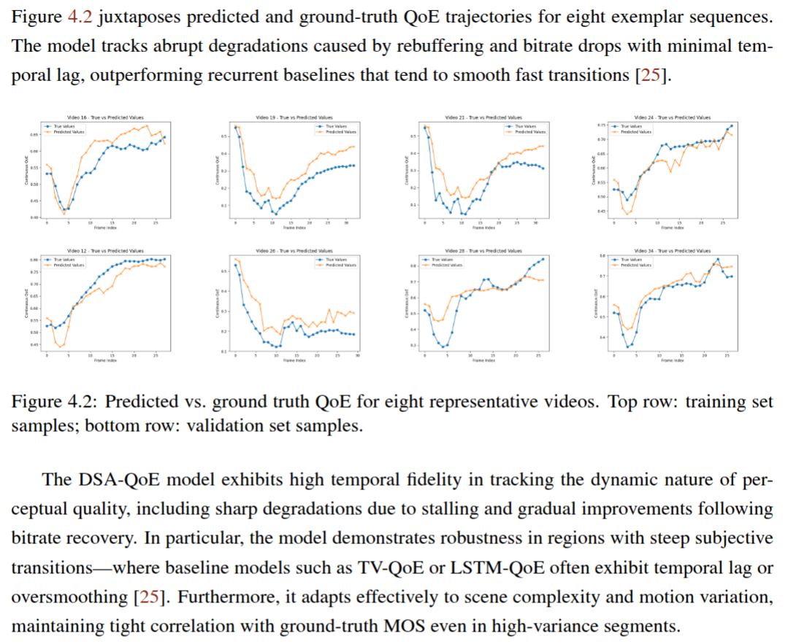

# cthadeufaria.github.io
**Machine Learning | Artificial Intelligence | Embedded Systems | Hardware Engineering | Computer Vision | IoT**

---

## Professional Profile

I am an engineer with a strong foundation in **electrical and computer engineering**, and professional focus on **machine learning**, **computer vision**, and **embedded systems**. My recent academic research applies **transformer-based architectures** to real-time video quality inference, integrated into production-level media pipelines using **Rust**.

With a background spanning industrial communication, embedded hardware prototyping, and software engineering, I bring robust interdisciplinary experience to complex technical projects.

---

## Areas of Expertise

- **Machine Learning & Computer Vision**  
  Deep learning (PyTorch, Hugging Face), image/video processing, transformer architectures

- **Embedded & Hardware Systems**  
  Raspberry Pi prototyping, sensor integration, real-time pipelines in Python and Rust

- **Software Engineering & Tools**  
  Rust, Python, C/C++, Git, GStreamer, ROS, PostgreSQL

- **Real-Time Inference Systems**  
  Deployment of AI models in latency-constrained environments using TorchScript & tch-rs

---

## Published Paper

### _AI-Driven Media Quality Monitoring System_

This work presents a full-stack implementation of a **dual-stage attention neural network** for **no-reference video quality assessment**, integrated into a real-time media processing system using **Rust and GStreamer**.

The system achieves sub-second inference latency and demonstrates strong perceptual alignment on the LIVE-NFLX-II dataset. It offers a practical framework for real-time monitoring of streaming media quality.

  

- [📄 Download full dissertation (PDF)](dissertation.pdf)

---

## Selected Projects

### 🎛️ [Raspberry Pi Curtain Video Control](https://github.com/cthadeufaria/raspberry-pi-curtain-video-control)
**Embedded Interactive Kiosk System**

- Python-based control of video playback based on motion sensor input  
- Real-time I/O interaction on Raspberry Pi 5  
- Designed for advertising kiosks and interactive installations

---

### 📡 [RPI Audio Stream](https://github.com/cthadeufaria/rpi_audio_stream)
**IoT Audio Broadcasting over Local Network**

- Wi-Fi-based paging and audio triggering system  
- MP3 playback triggered by client-server messages across Raspberry Pi devices  
- Hardware-focused audio streaming prototype with scalable architecture

---

### 🎥 [Dual Stage Attention](https://github.com/cthadeufaria/dual-stage-attention)
**ML-based QoE Prediction with Real-Time Inference**

- Transformer-based architecture for no-reference video quality estimation  
- Trained on LIVE-NFLX-II; integrated into real-time GStreamer pipeline using Rust  
- TorchScript model with sub-second inference latency on live video

---

### 🧪 [Computer Vision Defect Detection](https://github.com/cthadeufaria/computer-vision-defect-detection)
**Image Classification and Segmentation Pipeline**

- Built for industrial defect detection and semantic segmentation tasks  
- Combines classical preprocessing with PyTorch CNN classifiers  
- Includes dataset setup, augmentation, training scripts, and evaluation tools

---

## Curriculum Vitae

For a complete overview of my technical qualifications, project experience, and academic background:

- [📄 Download CV (PDF)](CV.pdf)

---

## Contact

If you're looking for engineering expertise in AI, embedded systems, or applied machine learning, feel free to reach out:

📍 Porto, Portugal  
📧 [crls.thadeu@gmail.com](mailto:crls.thadeu@gmail.com)  
🔗 [LinkedIn](https://www.linkedin.com/in/carlos-faria-33b51291/)  
🔗 [GitHub](https://github.com/cthadeufaria)  

---

© 2025 Carlos Faria. All rights reserved.
🔗 [html version](index.html)  
